# PostHog + Movie Database app

This project demonstrates:

1. [How to display a PostHog survey in a React and TypeScript app](#-posthog-survey)
2. [How to connect a Google Sheet to the PostHog Data Warehouse and display it in your frontend](#-posthog-query-api-with-google-sheets)
3. [How to track Events in the search bar](#-track-events)
4. [How to apply Session Recordings to your Typescript project](#-session-replay)
5. [How to test new features with only 5% of your users with Feature Flags](#-feature-flags)

Each link is an anchor link that will send you to the correct section in this Readme file.

You can view the website by clicking my link: [https://posthog-movie-app.netlify.app/](https://posthog-movie-app.netlify.app/)


---

## What is the main app?

This is a React/TypeScript app that calls on [themoviedb API](https://www.themoviedb.org/?language=en-US) to display movie posters. You can search for specific posters in the search bar and then clear the search results by clicking the Home button.

Tech Stack:

- React
- TypeScript
- Vite
- CSS
- [themoviedb API](https://www.themoviedb.org/?language=en-US)
- Vercel (Hosting)

---

# 📝 PostHog Survey:

## What is a Posthog Survey?

A PostHog survey is a feature that allows you to collect direct feedback from your users inside your product. Instead of sending them to a form or email, PostHog shows the survey right in your app or website. This is useful if you want your users to provide details on what they like or dislike about your website or products, without having to send them an email.

# How do I get a Posthog Survey on my website?

Below are the steps to follow if you want to create your own survey on your website. If you've already configured your project to have Posthog, you can skip the configuration section and go to the **Adding a Survey to your app** section of this Readme file.

## Configure PostHog into your project:

1. Create an account on [https://posthog.com/](https://posthog.com/)
2. Create your organization by giving it a name.
   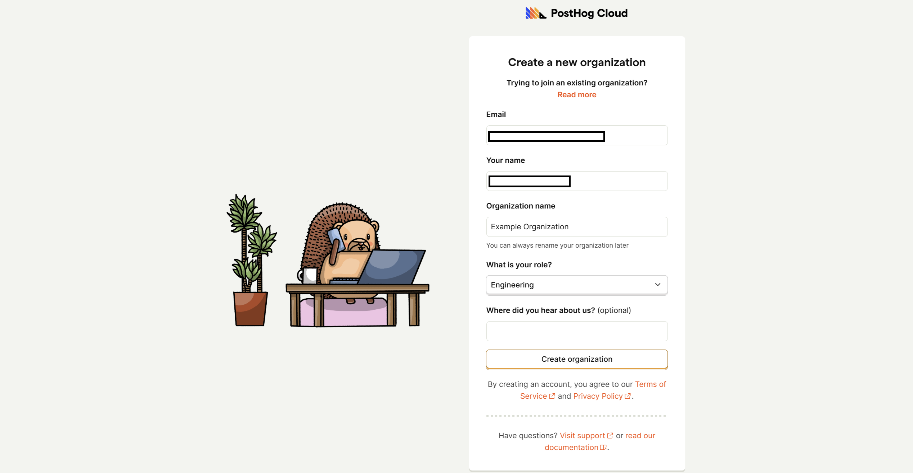
3. Let PostHog know which features you're interested in.
   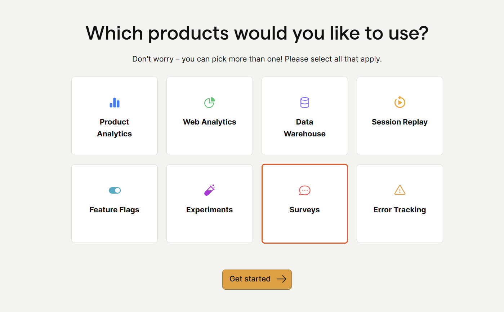
4. Select a framework you want to attach PostHog to. I ended up picking React because that's what I used to make my app.
   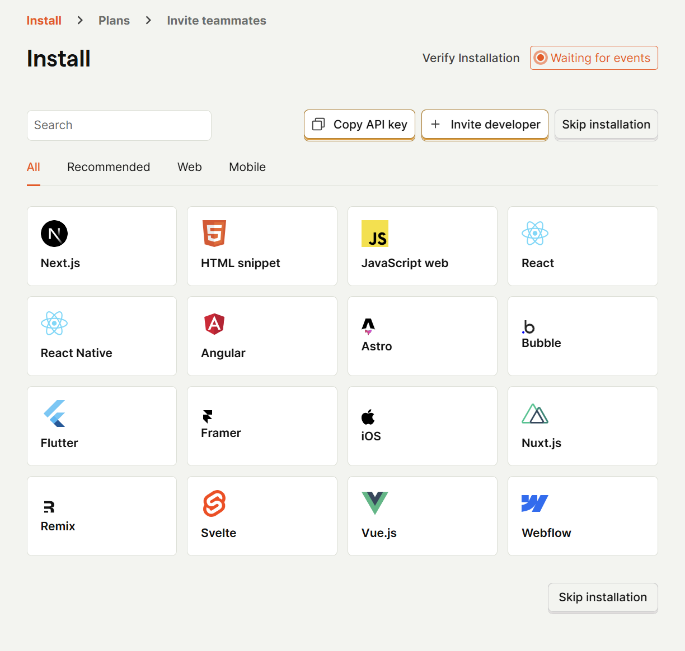
5. Follow the installation guide. This part is pretty easy. All you have to do is run an npm install on posthog-js, apply your VITE environment variables, and update your main.tsx file.
   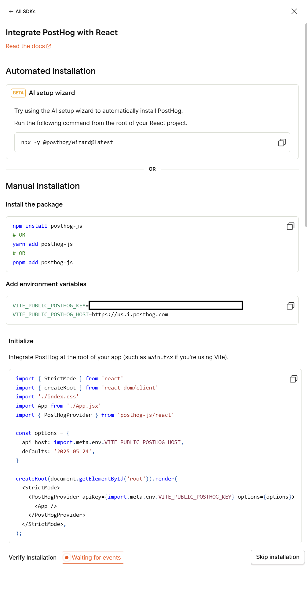

**Note for TypeScript users:**
If you’re seeing warnings or errors in your main.tsx file, use this version to resolve them:

```
import { StrictMode } from "react";
import { createRoot } from "react-dom/client";
import "./index.css";
import App from "./App.jsx";
import { PostHogProvider } from "posthog-js/react";

const options = {
  api_host: import.meta.env.VITE_PUBLIC_POSTHOG_HOST,
  // Remove 'defaults'
};

const rootElement = document.getElementById("root");

if (!rootElement) {
  throw new Error(
    'Root element with id "root" not found. Make sure your index.html contains <div id="root"></div>'
  );
}

createRoot(rootElement).render(
  <StrictMode>
    <PostHogProvider
      apiKey={import.meta.env.VITE_PUBLIC_POSTHOG_KEY}
      options={options}
    >
      <App />
    </PostHogProvider>
  </StrictMode>
);
```

- Removed the defaults property from the options object, as it is not supported by the React PostHogProvider and causes TypeScript errors.
- Added a check to ensure the root element exists before rendering, preventing runtime errors.

6. Select which plan you want (Free or paid)
7. Invite your teammates (Optional)

Your project now has PostHog configured into it. Now it's time to add the survey so it pops up!

## Adding a Survey to your app

1. Click the survey button on the dropdown menu on the left menu. You might need to configure your Surveys API to allow Surveys. Thankfully, that's as easy as two button clicks!

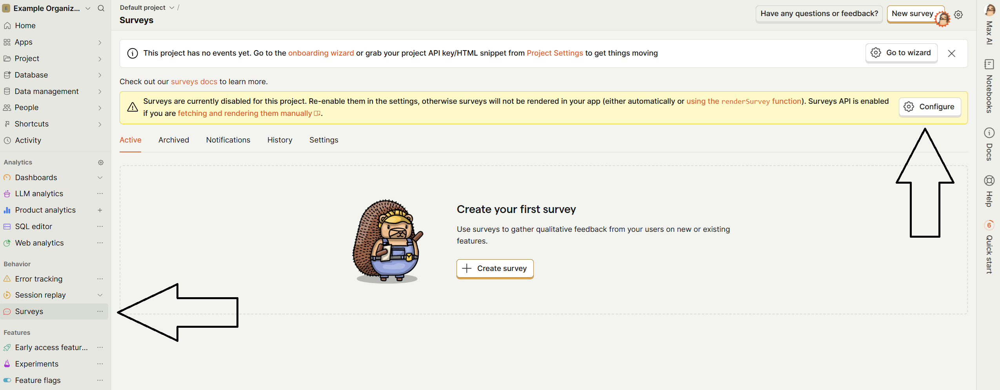 2. Click "Create Survey" and select which one you want. I'll be going with the one that is the most popular and allows users to type out their feedback.

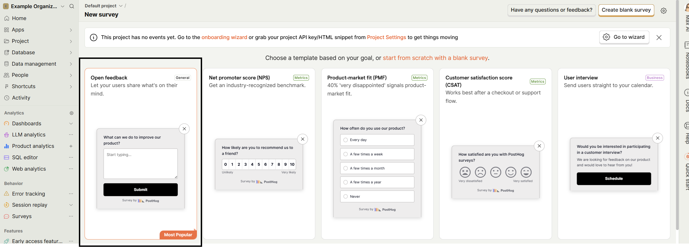
From here, you're going to see a lot of options to customize your app:

- Presentation: I'd recommend the Popover option for starting. This will make your survey pop up on the screen.
- Steps: Customize what the question says and what the submit button can say.
- Customization: Change how it looks, from size to color.
- Display conditions: Keep it **All Users** for now. You can change it later to fit certain conditions
- Completion Conditions: For testing, I'm keeping it as is

Once you've customized your survey, click Save at the top right of the screen.

3. To have your survey active, click the **Launch** button in the top right of the screen. Once you've confirmed the launch, the survey should be on your connected app!

---

# 📂 PostHog Query API with Google Sheets:

## What is a PostHog Query API with Google Sheets?

PostHog lets you connect lots of data sources, one of them is Google Sheets! This means you can pull in data from your spreadsheets and use it in PostHog to track trends, see metrics, or combine it with other data without any complicated setup.

## See this functionality in action before learning about it.

Look up [my app](https://posthog-movie-app.netlify.app/) and click the **Posthog Query API** button. It pulls movies from my Google Sheet using the Posthog API and displays films about [Hedgehogs](https://posthog.com/blog/drawing-hedgehogs)!

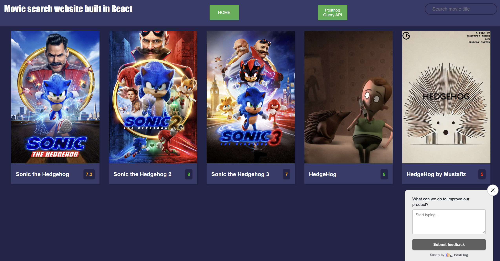

## How to set up a Source and use the PostHog API to call the data

Before you start, you'll need a Google sheet with example data.
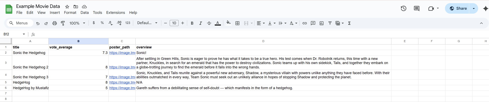

1. **Connect Google Sheets to PostHog** \
   Go to your PostHog project.
   Navigate to Data pipeline > Sources.
   Add a new Google Sheets source and follow the prompts to connect your sheet.
   Wait for the initial sync to complete. You can trigger a manual sync from the source settings if needed.
2. **Create a Personal API Key in PostHog** \
   Go to your Personal API keys page (Settings --> Search "API"). \
   Create a new key with Query: Read permission and restrict it to your project for security.
   Copy your API key.
3. **Test if you can access your data.**  
   I recommend using [Postman](https://postman.com/) to test the PostHog API. Here are the steps:

- Set the request to **POST**
- Add this URL to the input:
  `https://us.posthog.com/api/projects/{Project_id}/query`
- Add this JSON to body --> raw

```
{
  "query": {
    "kind": "HogQLQuery",
    "query": "SELECT * FROM googlesheets.NAME_OF_YOUR_SHEET_HERE LIMIT 10"
  }
}
```

- Add these two to your Headers: \
  **KEY**: Authorization **VALUE**: Bearer API_KEY_HERE \
  **KEY** Content-Type **VALUE**: application/json

4.  **Set up your Backend project** \
    This can be done in several ways, but I recommend creating a simple [Netlify](https://www.netlify.com/) function. You can see my [backend code by clicking here](https://github.com/JamieDawson/posthog-backend-movie-app)
5.  Use the URL generated by Netlify. \
    Now that you have a link generated by Netlify, you can call it on the frontend and have the data displayed!

---

# 🔍 Track Events

## What is Event Tracking?

Event tracking involves keeping tabs on what people do in your app, such as when they click, search, or make a purchase. Each action gets sent to PostHog along with extra details (called properties) that explain what happened.

## What event is this app tracking?

This app tracks what users are typing in the search bar. I'm able to see how many times someone would type "Hedgehog" to look up movies with Hedgehog in the title.

## How I set up event tracking in my app.

1. I imported usePostHog from [posthog-js/react](https://github.com/PostHog/posthog-js)

```
import { usePostHog } from "posthog-js/react";
```

2. I created an instance of `usePostHog()` inside my App() component.

```
  const posthog = usePostHog();
```

3. Updated my `handleOnSubmit()` function so that if the instance is found, it sends an object to my Posthog account that can be tracked. Using the `posthog.capture` command, I create an object called `movie_search` that contains `search_term` and `results_count`.

```
  const handleOnSubmit = (e: React.FormEvent<HTMLFormElement>) => {
    e.preventDefault();
    if (searchTerm) {
      fetch(SEARCH_API + searchTerm)
        .then((res) => res.json())
        .then((data) => {
          const results = data.results || [];
          setMovies(results);

          if (posthog) {
            posthog.capture("movie_search", {
              search_term: searchTerm,
              results_count: results.length,
            });
          }
        })
        .catch((err) => console.error("Error fetching search results:", err));
    }
  };
```

## Viewing the data in Posthog!

So now that the data is being sent back to Posthog, let's talk about viewing it.

### Viewing general activity

1. Click the **Activity** tab on the left dropdown menu
2. Look for the name of the event you created. (Example: `movie_search`)
3. Click the **Hide PostHog properties** button to make it easier to find the items in the object.

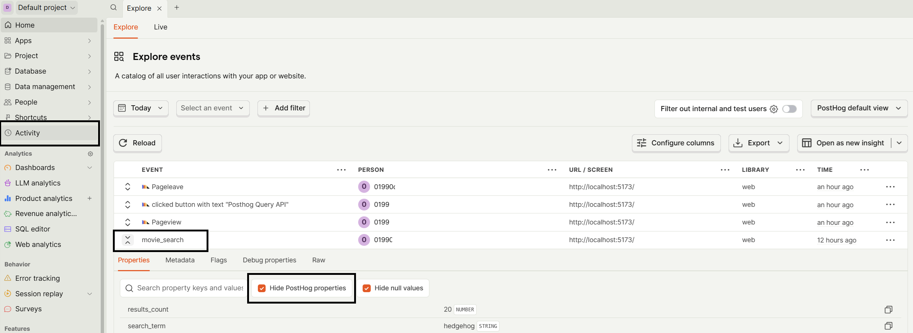

### Organizing the data

To organize your data, you'll need to:

1. Click the **Product Analytics** tab on the left side of the screen
2. Click the **New** button on the top-right
3. In the section called **series**, click the name of the event you want to track. In my example, I'm tracking `movie_search`.
4. In the **Breakdown By** section, look up what you want to search for. I want to look up `search_term` and `results_count`, which are the two bits of data sent back in my `movie_search` object!

## 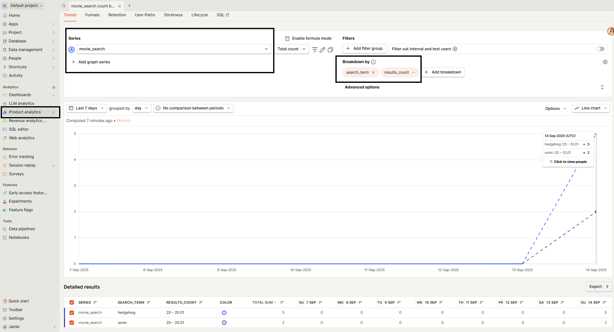

# 🎥 Session Replay

## What is Session Replay

Session replay is a playback of what users do on your site. Things like clicks, scrolls, typing, and navigation can be viewed in a screen recording that's captured right from the browser. It helps you see how people actually use your app so you can spot issues or understand behavior without guessing.

## How to set up Session Replay in your app.

### Configuring in Posthog:

Enabling Session Replay in your account is very easy! You're pretty much just clicking three buttons!

1. Click the **Session Replay** button on the left side of the screen.
2. Click the **Configure** button in the top middle of the page.
   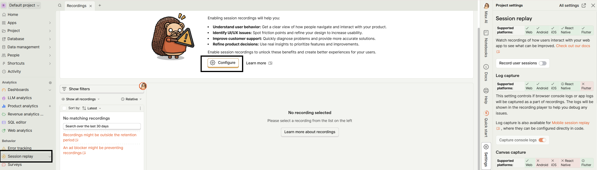
3. Click the **Record Users Session** button, and you'll have it set up on your account!
   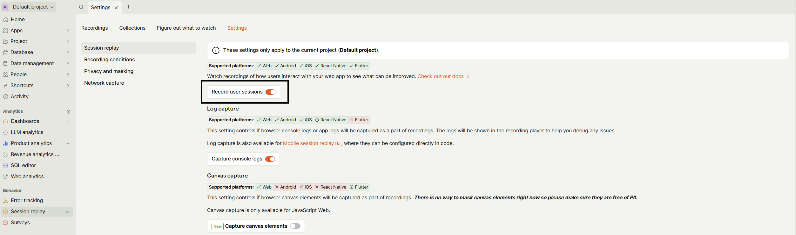

### Configuring in your TypeScript app:

1. In your `main.tsx` app, add the `session_recording` object in your `PostHogProvider` \
   This code:

- Imports `posthog-js/react` and provides `PostHogProvider`
- Wraps `PostHogProvider` around your `<App />` component
- Provides the `session_recordings` object, which gives your app the ability to record.
- `session_recording` also includes `maskAllInputs: false`. You would want to set this to true if your input fields were taking sensitive information. But my one input field only takes in the names of films, so I'm not too worried.

```
import { StrictMode } from "react";
import { createRoot } from "react-dom/client";
import "./index.css";
import App from "./App.jsx";
import { PostHogProvider } from "posthog-js/react";

const options = {
  api_host: import.meta.env.VITE_PUBLIC_POSTHOG_HOST,
  session_recording: {
    maskAllInputs: false, // User aren't typing sensitive info in input fields.
  },
};

const rootElement = document.getElementById("root");

if (!rootElement) {
  throw new Error(
    'Root element with id "root" not found. Make sure your index.html contains <div id="root"></div>'
  );
}

createRoot(rootElement).render(
  <StrictMode>
    <PostHogProvider
      apiKey={import.meta.env.VITE_PUBLIC_POSTHOG_KEY}
      options={options}
    >
      <App />
    </PostHogProvider>
  </StrictMode>
);
```

2. After adding that code, test your app by doing something in it. To test, I went to my app and searched "Hedgehog" in the search bar. \
    Once you've added that, go back to the **Session Replay** button and watch the footage of your session. It might take a few seconds to generate the footage. \
    Check out this Gif below to see Sessions Replay in action!

   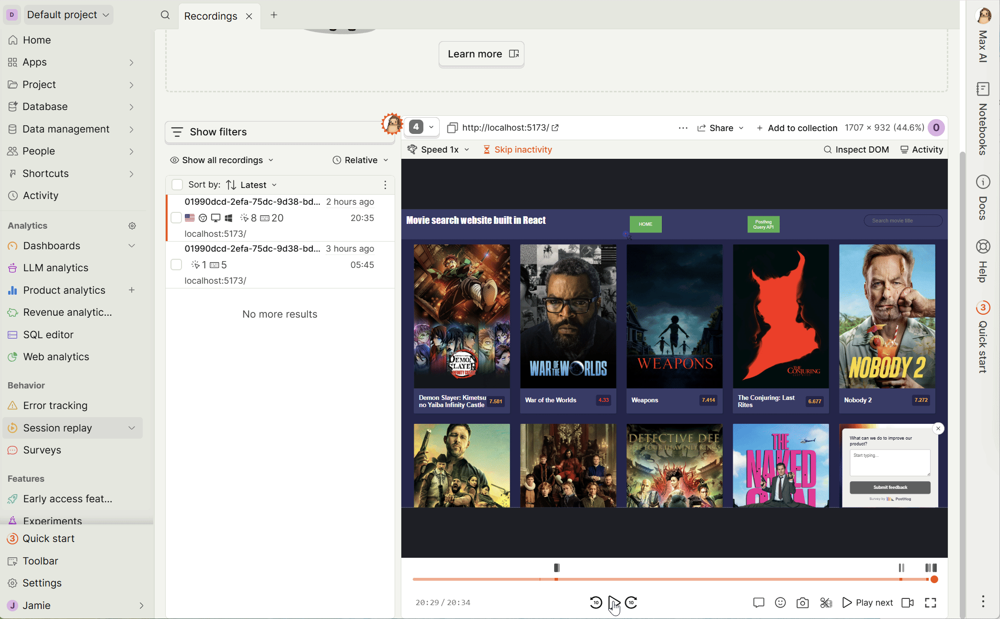

# 🚩 Feature Flags:

## What are Feature Flags?

[Feature Flags](https://posthog.com/feature-flags) are an easy way to test new features on a small percentage of your users without having to push new code to production. Meaning you can make a new feature, tell PostHog "only give this out to 5% of my users", then see how your users experience that new feature!

## What feature did I add a Feature Flag to?

I created a button that sets my app to Dark Mode and Light Mode.

## Configure in PostHog

1.  Click the **Feature Flags** button on the left side of the screen
2.  Click **New Feature Flag** button on the top right

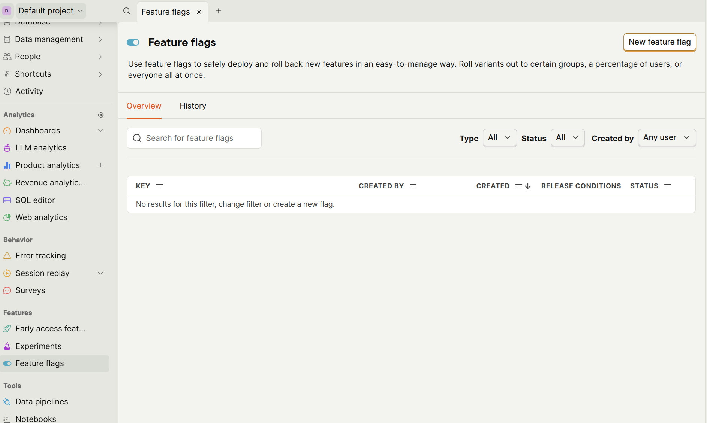

3.  Give it a key name. I went with `dark-mode`. This is the flag that will be sent to your code, so you know if it's in use or not.
4.  Give it a description.
5.  Make sure **Enable Feature Flag** is on!
       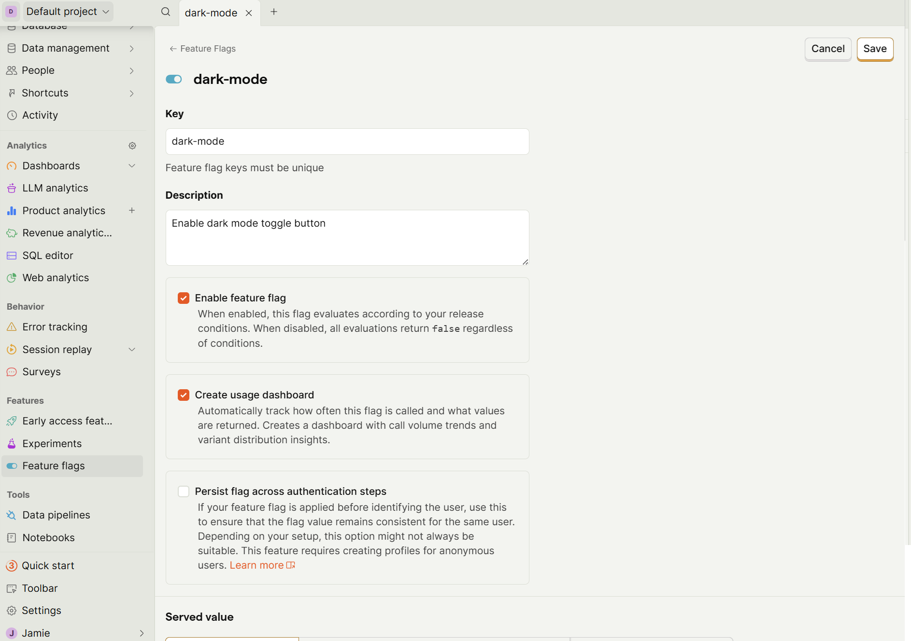
6.  **Served Value** sets what is served. I want to check true or false, so I set it to **Release Toggle (Boolean)**
7.  **Release Conditions** is what's used to determine who gets the feature. For testing purposes, I set it to 100%.
8.  Click the **Create** button and you're done in Posthog!

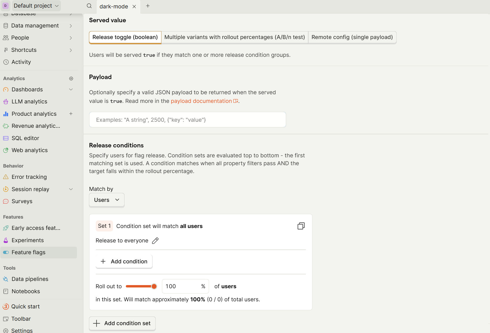

## Configure Feature Flag in Code

What this code will do is check if the `dark-mode` flag from PostHog is set to true. If it's true, then it will display the Dark Mode/Light Mode button in the header!

To get this feature ready, I first:

1. Created the CSS for Dark Mode
2. Created the state to confirm if the `dark-mode` flag was sent back as true

```
 const [showDarkModeToggle, setShowDarkModeToggle] = useState(false);
```

3. Created a turnerary that will display a button if the `dark-mode` button is set to true.

```
        {showDarkModeToggle && (
          <button
            type="button"
            className="button"
            onClick={handleToggleDarkMode}
            style={{ minWidth: 120 }}
          >
            {darkMode ? "Light Mode" : "Dark Mode"}
          </button>
        )}
```

4. Now I’ll set up a useEffect() hook that runs after the component first renders. I numbered all the steps that run in order.

```
useEffect(() => {
  // 1. Check if PostHog is available. If not, exit early.
  if (!posthog) return;

  // 2. Define a function to update the state based on the feature flag.
  const updateFlag = () => {
    // Check if the flag is enabled (true/false/undefined).
    // Using !! ensures we always get a strict boolean.
    setShowDarkModeToggle(!!posthog.isFeatureEnabled("dark-mode"));
  };

  // 3. Register updateFlag as a listener for feature flag changes.
  //    PostHog will call updateFlag whenever flags change for this user.
  //    onFeatureFlags returns an unsubscribe function.
  const unsubscribe = posthog.onFeatureFlags(updateFlag);

  // 4. Immediately call updateFlag to set the initial state right now.
  updateFlag();

  // 5. Return a cleanup function to unsubscribe when the component unmounts.
  return () => {
    unsubscribe();
  };

// 6. This effect re-runs if posthog changes.
}, [posthog]);
```

### What happens when I change a roll out percentage?

PostHog uses a deterministic hashing strategy to assign users. We hash the user's distinct_id to a number between 0 and 1 (0-100%), and compare it against the roll out percentage.

- If you increase the percentage, users who already matched will continue to match, and more users may now qualify.

- If you decrease the percentage, some users who previously matched may fall outside the new threshold and stop qualifying.

This applies to both boolean and multivariate flags. Multivariate flags assign users to specific variants based on the rollout split. If you want to roll out one variant to everyone, set it to 100% and the others to 0%. ([Source - Search "What happens when I change a roll out percentage?"](https://posthog.com/docs/feature-flags/common-questions))
